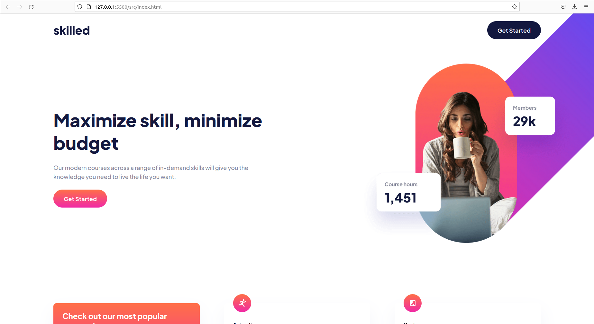

# Frontend Mentor - Skilled e-learning landing page solution

This is a solution to the [Skilled e-learning landing page challenge on Frontend Mentor](https://www.frontendmentor.io/challenges/skilled-elearning-landing-page-S1ObDrZ8q). I use Frontend Mentor challenges to help improve my coding skills by building realistic projects.

## Table of contents

- [Overview](#overview)
  - [The challenge](#the-challenge)
  - [Screenshot](#screenshot)
  - [Links](#links)
- [My process](#my-process)
  - [Built with](#built-with)
  - [What I learned](#what-i-learned)
  - [Continued development](#continued-development)
  - [Useful resources](#useful-resources)
- [Author](#author)

## Overview

### The challenge

Users should be able to:

- View the optimal layout depending on their device's screen size
- See hover states for interactive elements

### Screenshot

### Links

- Solution URL: [Add solution URL here](https://your-solution-url.com)
- Live Site URL: [Add live site URL here](https://your-live-site-url.com)

## My process

### Built with

- Semantic HTML5 markup
- CSS
- Flexbox
- CSS Grid
- Mobile-first workflow

### What I learned

I was learning all about relative units with this project. I tried to use rem, em, %, and other relative units rather than absolute units like pixels. I've been reading Manning Publication's CSS IN DEPTH by Keith J. Grant.

### Continued development

I want to keep improving my ability to build fluid, responsive layouts and keep improving with my layout/positioning skills.

### Useful resources

- [CSS in Depth](https://www.manning.com/books/css-in-depth) - This helped understand relative units and the box model really well. Chapters 1-4.

## Author

- Website - [Patrick Clover]
- Frontend Mentor - [@pcloverdevelopment](https://www.frontendmentor.io/profile/pcloverdevelopment)
- LinkedIn - [@Patrick Clover](https://www.linkedin.com/in/patrick-clover-1b8857124/)

